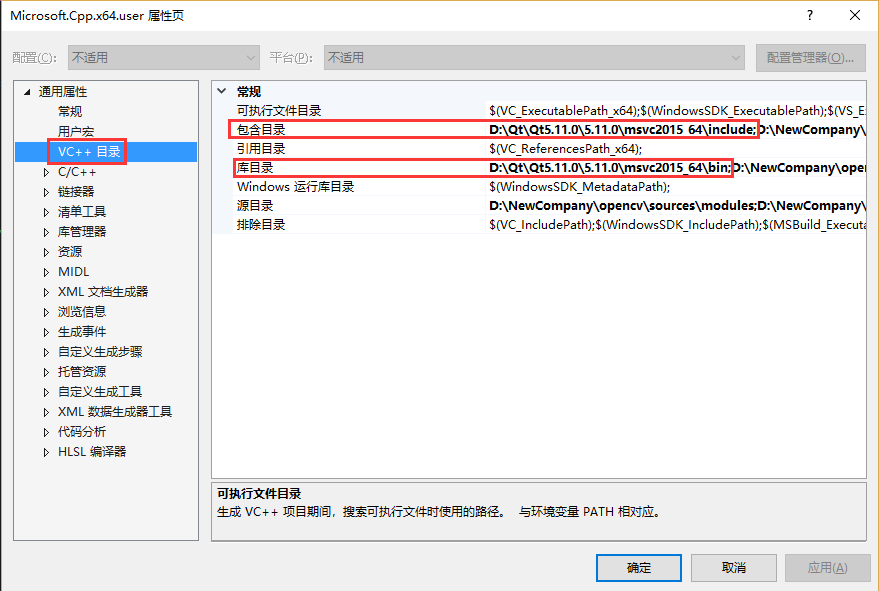
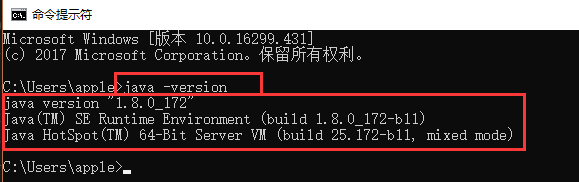
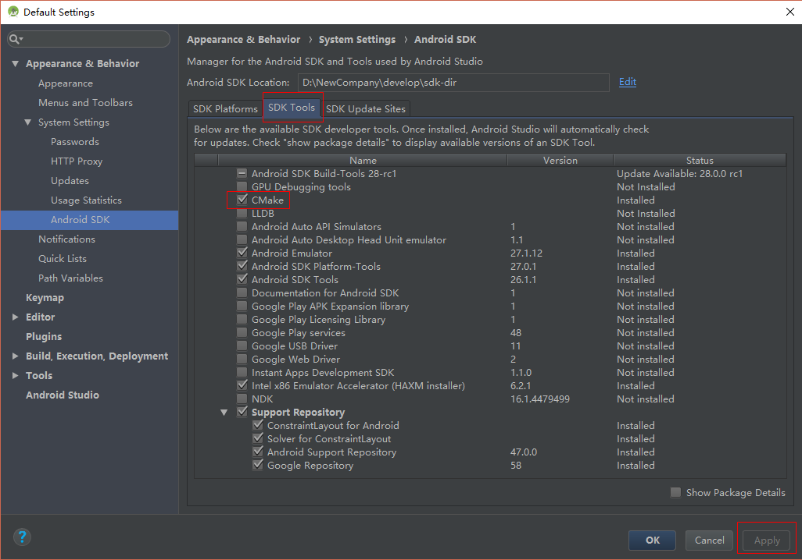
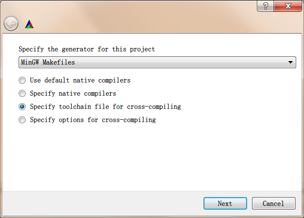
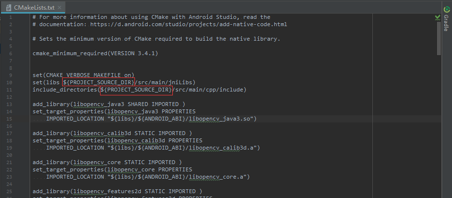

# **Windows 下 OpenCV 3.4.0 + Contrib 部署文档 (VS2015 & Android)**

## **目录**

- [**Windows 下 OpenCV 3.4.0 + Contrib 部署文档 (VS2015 & Android)**](#windows-%E4%B8%8B-opencv-340--contrib-%E9%83%A8%E7%BD%B2%E6%96%87%E6%A1%A3-vs2015--android)
    - [**目录**](#%E7%9B%AE%E5%BD%95)
    - [VS 篇](#vs-%E7%AF%87)
        - [**编译 OpenCV + OpenCV_Contrib (+ Qt) + VS2015**](#%E7%BC%96%E8%AF%91-opencv--opencvcontrib--qt--vs2015)
            - [**1. 编译环境准备**](#1-%E7%BC%96%E8%AF%91%E7%8E%AF%E5%A2%83%E5%87%86%E5%A4%87)
            - [**2. 编译配置**](#2-%E7%BC%96%E8%AF%91%E9%85%8D%E7%BD%AE)
            - [**3. 执行编译**](#3-%E6%89%A7%E8%A1%8C%E7%BC%96%E8%AF%91)
        - [**Visual Studio 项目使用 OpenCV**](#visual-studio-%E9%A1%B9%E7%9B%AE%E4%BD%BF%E7%94%A8-opencv)
            - [**1. 创建新项目**](#1-%E5%88%9B%E5%BB%BA%E6%96%B0%E9%A1%B9%E7%9B%AE)
            - [**2. 在 VS 中配置 OpenCV**](#2-%E5%9C%A8-vs-%E4%B8%AD%E9%85%8D%E7%BD%AE-opencv)
            - [**3. 通过 CMakeLists.txt 生成 VS 解决方案**](#3-%E9%80%9A%E8%BF%87-cmakeliststxt-%E7%94%9F%E6%88%90-vs-%E8%A7%A3%E5%86%B3%E6%96%B9%E6%A1%88)
            - [**4. 项目调试进入 OpenCV 源码**](#4-%E9%A1%B9%E7%9B%AE%E8%B0%83%E8%AF%95%E8%BF%9B%E5%85%A5-opencv-%E6%BA%90%E7%A0%81)
        - [**注意事项**](#%E6%B3%A8%E6%84%8F%E4%BA%8B%E9%A1%B9)
            - [1. 编译 Qt 版时 opencv_cvv 模块的 stringutils.cpp 文件出现“常量中有换行符”的错误](#1-%E7%BC%96%E8%AF%91-qt-%E7%89%88%E6%97%B6-opencvcvv-%E6%A8%A1%E5%9D%97%E7%9A%84-stringutilscpp-%E6%96%87%E4%BB%B6%E5%87%BA%E7%8E%B0%E5%B8%B8%E9%87%8F%E4%B8%AD%E6%9C%89%E6%8D%A2%E8%A1%8C%E7%AC%A6%E7%9A%84%E9%94%99%E8%AF%AF)
            - [2. 编译 Qt 版时 opencv_cvv 模块的 dual_filter_view.cpp 文件出现“使用未定义的xxx”的错误](#2-%E7%BC%96%E8%AF%91-qt-%E7%89%88%E6%97%B6-opencvcvv-%E6%A8%A1%E5%9D%97%E7%9A%84-dualfilterviewcpp-%E6%96%87%E4%BB%B6%E5%87%BA%E7%8E%B0%E4%BD%BF%E7%94%A8%E6%9C%AA%E5%AE%9A%E4%B9%89%E7%9A%84xxx%E7%9A%84%E9%94%99%E8%AF%AF)
        - [**参考**](#%E5%8F%82%E8%80%83)
    - [AS 篇](#as-%E7%AF%87)
        - [**编译 OpenCV + OpenCV_Contrib + Android**](#%E7%BC%96%E8%AF%91-opencv--opencvcontrib--android)
            - [**1. 编译环境准备**](#1-%E7%BC%96%E8%AF%91%E7%8E%AF%E5%A2%83%E5%87%86%E5%A4%87-1)
            - [**2. 编译配置**](#2-%E7%BC%96%E8%AF%91%E9%85%8D%E7%BD%AE-1)
            - [**3. 执行编译**](#3-%E6%89%A7%E8%A1%8C%E7%BC%96%E8%AF%91-1)
        - [**Android Studio 项目使用 OpenCV**](#android-studio-%E9%A1%B9%E7%9B%AE%E4%BD%BF%E7%94%A8-opencv)
            - [**1. 创建新项目**](#1-%E5%88%9B%E5%BB%BA%E6%96%B0%E9%A1%B9%E7%9B%AE-1)
            - [**2. 在项目中导入 OpenCV**](#2-%E5%9C%A8%E9%A1%B9%E7%9B%AE%E4%B8%AD%E5%AF%BC%E5%85%A5-opencv)
            - [**3 修改 OpenCV build.gradle**](#3-%E4%BF%AE%E6%94%B9-opencv-buildgradle)
            - [**4 设置 Module 依赖**](#4-%E8%AE%BE%E7%BD%AE-module-%E4%BE%9D%E8%B5%96)
            - [**5 剔除 OpenCV Manager 依赖**](#5-%E5%89%94%E9%99%A4-opencv-manager-%E4%BE%9D%E8%B5%96)
            - [**6 配置CMakeLists.txt，加载 OpenCV SO**](#6-%E9%85%8D%E7%BD%AEcmakeliststxt%E5%8A%A0%E8%BD%BD-opencv-so)
            - [**7 修改代码，调用OpenCV方法**](#7-%E4%BF%AE%E6%94%B9%E4%BB%A3%E7%A0%81%E8%B0%83%E7%94%A8opencv%E6%96%B9%E6%B3%95)
        - [**注意事项**](#%E6%B3%A8%E6%84%8F%E4%BA%8B%E9%A1%B9-1)
            - [1. openCVLibrary340 编译错误](#1-opencvlibrary340-%E7%BC%96%E8%AF%91%E9%94%99%E8%AF%AF)
            - [2. cmake vs ndkBuild](#2-cmake-vs-ndkbuild)
            - [3. so 文件引用错误](#3-so-%E6%96%87%E4%BB%B6%E5%BC%95%E7%94%A8%E9%94%99%E8%AF%AF)
            - [4. 摄像头竖屏全屏的设置](#4-%E6%91%84%E5%83%8F%E5%A4%B4%E7%AB%96%E5%B1%8F%E5%85%A8%E5%B1%8F%E7%9A%84%E8%AE%BE%E7%BD%AE)
            - [5. Session 'app': Error Installing APKs](#5-session-app-error-installing-apks)
            - [6. No implementation found for long org.opencv.core.Mat.n_Mat()](#6-no-implementation-found-for-long-orgopencvcorematnmat)
            - [7. 依赖模块 openCVLibrary340 编译找不到符号 BackgroundSubtractor (bgsegm 文件夹) / DenseOpticalFlow (optflow 文件夹)](#7-%E4%BE%9D%E8%B5%96%E6%A8%A1%E5%9D%97-opencvlibrary340-%E7%BC%96%E8%AF%91%E6%89%BE%E4%B8%8D%E5%88%B0%E7%AC%A6%E5%8F%B7-backgroundsubtractor-bgsegm-%E6%96%87%E4%BB%B6%E5%A4%B9--denseopticalflow-optflow-%E6%96%87%E4%BB%B6%E5%A4%B9)
        - [**参考**](#%E5%8F%82%E8%80%83-1)
            - [**1. 编译**](#1-%E7%BC%96%E8%AF%91)
            - [**2. 相机**](#2-%E7%9B%B8%E6%9C%BA)
            - [**3. 其他**](#3-%E5%85%B6%E4%BB%96)

## VS 篇

### **编译 OpenCV + OpenCV_Contrib (+ Qt) + VS2015**

#### **1. 编译环境准备**

1.1 下载 OpenCV 3.4.0 源码 `opencv-3.4.0.zip` (假定目录为 `<opencv-source>`)

1.2 下载 OpenCV_contrib 3.4.0 源码 `opencv_contrib-3.4.0.zip` (假定目录为 `<opencv-contrib>`)

**<font color=red>注意：</font>必须与 opencv 版本一致**

1.3 安装 cmake-gui 3.11.1 x64 cmake 的 GUI 工具 `cmake-3.11.1-win64-x64.msi`

1.4 安装 Visual Studio 2015

1.5 (可选)安装 Qt 5.11.0 `qt-opensource-windows-x86-5.11.0.exe`

- 选择必装组件 `MSVC 2015 64-bit`，如果后续使用 MinGW 编译则需安装对应组件，本文只介绍 VS 编译

    **<font color=red>注意：</font>如果后续想使用 Qt Creator 开发，必须勾选 `Qt Charts`，否则 qmake 时会报错**

    

- 安装后配置环境变量

    

- VS 中配置 Qt 关联，安装完后打开 VS，点击 `Menu -> Qt VS Tools -> Qt Options` 配置安装的 MSVC2015 组件

    

#### **2. 编译配置**

2.1 新建文件夹 `<build>/vs_opencv_contrib`

2.2 运行 cmake-gui.exe

2.3 在 `where is the source code` 填入 `<opencv-source>/source` 目录

2.4 在 `where to build the binaries` 填入 `<build>/vs_opencv_contrib` 目录

2.5 点击 configure，弹出选择编辑器的窗口，选择 `Visual Studio 14 2015 Win64` (Win64 是指编译 VS2015 x64 工程，不带 Win64 的则为 x86 工程)，默认第一个选项 `Use default native compilers`


2.6 配置完后会出现很多红色的配置项，搜索 `extra`，在 `OPENCV_EXTRA_MODULES_PATH` 添加路径 `<opencv-contrib>/modules`

2.7 (可选) 勾选 `WITH_QT`，再次 configure 后会出现关于 Qt 的路径配置参数，确保与下图一致


2.8 勾选需要的配置，点击 configure 后再点击 generate，显示：

    Configuring done
    Generating done

#### **3. 执行编译**

3.1 在上述编译配置完成后，打开 `<build>/OpenCV.sln`，设置要编译的模式(debug 还是 release，本文选择的是 debug x64)

3.2 (可选)配置 Qt 的库链接(后续如果出现编译错误请参考 注意事项)

- 点击 `Menu -> 视图 -> 其他窗口 -> 属性管理器`，打开 `opencv_highgui -> Debug | x64 -> Microsoft.Cpp.x64.user` 全局配置页，按下图配置

    

    

- 删除 `opencv_highgui` 和 `opencv_cvv` 项目属性配置页的多余配置

    

3.3 在解决方案的 CMakeTargets 文件夹下右击 `ALL_BUILD`，选择 `生成` (**<font color=red>注意：</font>耗费时间较长**)，成功后再右击 `INSTALL`，选择 `仅用于项目 -> 仅生成 INSTALL`，再次成功后，所编译的头文件和库在 `<build>/vs_opencv_contrib/install` 文件夹下

3.4 配置 opencv 的环境变量，在 `Path` 中加入 `<build>\vs_opencv_contrib\install\x64\vc14\bin`


### **Visual Studio 项目使用 OpenCV**

#### **1. 创建新项目**

打开 VS 2015，新建一个空白的 win32 的控制台工程

#### **2. 在 VS 中配置 OpenCV**

打开属性管理器中的全局配置页 `Microsoft.Cpp.x64.user`，按下图配置

(**<font color=red>注意：</font>配置管理器中，Debug 和 Release 下的 Microsoft.Cpp.x64.user 是同一个文件，所以在生成不同模式时需要更改配置，否则编译会出错；该文件属于全局配置，所有 VS 项目不用再次配置**)

- Debug 版

    

    

- Release 版
    - 将 debug 版中的 `附加依赖项` 改成 `*.lib` 即可


#### **3. 通过 CMakeLists.txt 生成 VS 解决方案**

3.1 运行 cmake-gui.exe

3.2 将 CMakeLists.txt 拖到 `where is the source code`

3.3 在 `where to build the binaries` 填入输出目录

3.4 点击 configure，弹出选择编辑器的窗口，选择 `Visual Studio 14 2015 Win64`，默认第一个选项 `Use default native compilers`

3.5 运行完后出现 OpenCV 找不到的报错，修改配置 `OPENCV_DIR` 为 `<build>/vs_opencv_contrib/install/x64/vc14/lib`，然后再次 configure

3.6 点击 generate，最终解决方案会在输出目录中

#### **4. 项目调试进入 OpenCV 源码**

**<font color=red>注意：</font>之前程序不运行时按 F12 能进入 opencv 源码，按该步骤操作后，必须在 debug 模式下，F11 进入 opencv 源码，F12 只能进入头文件，请斟酌操作**

4.1 修改全局配置如下


4.2 点击 `Menu -> 工具 -> 选项 -> 调试 -> 常规`，勾选 `启用源服务器支持` 及其子项


4.3 点击 `Menu -> 工具 -> 选项 -> 调试 -> 符号`，添加并勾选符号文件位置 `<build>\vs_opencv_contrib\bin\Debug`


4.4 修改 opencv 的环境变量地址为 `<build>\vs_opencv_contrib\bin\Debug`

### **注意事项**

#### 1. 编译 Qt 版时 opencv_cvv 模块的 stringutils.cpp 文件出现“常量中有换行符”的错误

原因：可能是文件编码方式导致的

**解决**：在源码文件夹 `<opencv-contrib>/modules/cvv/src/stfl` 中重新建立同名文本(删除原文件后改名)，并复制cpp文件内容

#### 2. 编译 Qt 版时 opencv_cvv 模块的 dual_filter_view.cpp 文件出现“使用未定义的xxx”的错误


原因：opencv 340 对 c++11 的兼容性问题，官方在 341 版本中已修复

**解决**：将源码文件 `<opencv-source>/modules/core/include/opencv2/core/cvdef.h` L436 替换成修复语句

``` c++
#  if __cplusplus >= 201103L || (defined(_MSC_VER) && _MSC_VER >= 1900/*MSVS 2015*/)
```


### **参考**

[1] [OpenCV学习笔记（一）——OpenCV3.1.0+VS2015开发环境配置 - CSDN博客](https://blog.csdn.net/linshuhe1/article/details/51177487)

[2] [Visual Studio 2015一分钟配置opencv及CMake编译OpenCV3.1(含opencv-contrib) - CSDN博客](https://blog.csdn.net/xingchenbingbuyu/article/details/53301987)

[3] [CMake 简介和 CMake 模板 - 简书](https://www.jianshu.com/p/03640a4caf7e)

[4] [调试opencv程序，怎么在vs运行下直接调到opencv的源码，终极，cmake后还要有pdb文件链接 - CSDN博客](https://blog.csdn.net/zkl99999/article/details/77863735)

[5] [Win10＋VS2013＋CMake-gui编译和配置OpenCV-3.2.0 | Shaun's Space](https://cniter.github.io/posts/7df528b4.html)

[6] [Qt+Opencv+cmake在win10系统下的完美配置 - CSDN博客](https://blog.csdn.net/sinat_36420785/article/details/79443418)

[7] [OpenCV3.2+Qt5.8.0+Win10配置和使用----（4）配置环境变量+编译opencv&opencv-contrib - CSDN博客](https://blog.csdn.net/qq_38880380/article/details/78012594)

[8] [OpenCV 3.4 编译和配置 - 胡马依北风 - 博客园](https://www.cnblogs.com/xinxue/p/5766756.html)

[9] [Win10(x64)+Qt5.8(MSVC2015)+OpenCV3.2.0配置过程 - CSDN博客](https://blog.csdn.net/zong596568821xp/article/details/78819275)

## AS 篇

### **编译 OpenCV + OpenCV_Contrib + Android**

#### **1. 编译环境准备**

1.1 下载 OpenCV 3.4.0 源码 `opencv-3.4.0.zip` (假定目录为 `<opencv-source>`)

1.2 下载 OpenCV_contrib 3.4.0 源码 `opencv_contrib-3.4.0.zip` (假定目录为 `<opencv-contrib>`)

**<font color=red>注意：</font>必须与 opencv 版本一致**

1.3 安装 cmake-gui 3.11.1 x64 cmake 的 GUI 工具 `cmake-3.11.1-win64-x64.msi`

1.4 安装 Mingw 编译工具 `mingw-get-setup.exe` (假定目录为 `<mingw-dir>`，此案例中为安装目录为 C:\MinGW)

- 可以选择 mingw32 或者 mingw64 都是可以的。后续采用的是 mingw32

    

- 选择需要安装的组件，右键选择 `Mark for Installation`，之后选择 `Menu -> Installation -> Apply Changes` (过程漫长)

- 新建系统变量/用户变量 `MinGW`，目录为 `<mingw-dir>`，并将 `%MinGW%\bin` 添加进系统变量(需重启电脑生效)/用户变量(无需) `Path` (建议用 `编辑文本` 检查下或直接点击  `编辑文本` 新增，避免出现多余的引号错误)

    

    

1.5 下载 Android NDK r15c x64 `android-ndk-r15c-windows-x86_64.zip` (假定目录为 `<ndk-dir>`)

**<font color=red>注意：</font>r16b 版 `<ndk-dir>/platforms/android-x/x/usr/include` 的文件夹位置已移动到 `<ndk-dir>/ndk-bundle/sysroot/usr/include`，影响后续 cmake 编译**

1.6 安装 java jdk 8 `jdk-8u172-windows-x64.exe`

- jdk (假定目录为 `<jdk-dir>`)安装包包含 jre (假定目录为 `<jre-dir>`)

- 安装后配置环境变量，新建系统变量/用户变量 `JAVA_HOME`，目录为 `<java-dir>`，并将 `%JAVA_HOME%\bin` 添加到 `Path` 环境变量中

    

    

- 用 cmd 可测试是否正确安装与配置

    

1.7 安装 Android Studio `android-studio-ide-173.4697961-windows.exe`

- 官网中仅提供无 sdk 版，首次打开会提示 Unable to access Android SDK add-on list

    

- 原因：在第一次安装 AS，启动后检测到电脑没有 SDK

- **解决方案**：点击 `Cancel`，在后续的界面安装 SDK (需要翻墙下载)

    

1.8 安装 Android SDK >= 19 (假定目录为`<sdk-dir>`)

**注意**：SDK 的版本安装全一点，从 API_LEVEL = 19 以上的都下了最好。可通过 AS 的 SDK Manager 管理安装




1.9 下载 Java ANT 1.10.3 `apache-ant-1.10.3-bin.zip` (假定目录为`<ant-dir>`)

**<font color=red>注意：</font>1.9.x 依赖 Java5 runtime，1.10.x 依赖 Java8 runtime**

#### **2. 编译配置**

2.1 新建文件夹 `<build>/armeabi-v7a`

2.2 运行 cmake-gui.exe

2.3 在 `where is the source code` 填入 `<opencv-source>` 目录

2.4 在 `where to build the binaries` 填入 `<build>/armeabi-v7a` 目录

2.5 点击 Add Entry，添加 `ANDROID_NDK`，并设定为 `PATH` 类目，填入 `<nkd-dir>` 目录

2.6 点击 Add Entry，添加 `ANDROID_NDK_HOST_X64`，并设定为 `BOOL` 类目，勾选 (NDK 为 64 位版本则勾选，否则不勾选)

2.7 点击 Add Entry，添加 `CMAKE_TOOLCHAIN_FILE`，并设定为 `FILEPATH` 类目，设置路径为 `<opencv-source>/platforms/android/android.toolchain.cmake`

2.8 点击 Add Entry，添加 `CMAKE_BUILD_WITH_INSTALL_RPATH`，并设定为 `BOOL` 类目，勾选

2.9 点击 Add Entry，添加 `ANDROID_SDK`，并设定为 `PATH` 类目，设置路径为 `<sdk-dir>`

2.10 点击 Add Entry，添加 `ANDROID_ABI`，并设定为 `STRING` 类目，设置值为 `armeabi-v7a`

**注意**：这里的选项也即你需要编译的库类型，如果你想要编译 armeabi 或者 X86 都在这个值上修改 (cpu架构，只能一个一个编译)

2.11 点击 Add Entry，添加 `ANDROID_NATIVE_API_LEVEL`，并设定为 `STRING` 类目，设置值为 `19`

**注意**：这里的选项也即你需要编译的 API-LEVEL，我定的是 19，你也可以用 20 或者 21；编译 x86 时可能需要设置高一些，例如 19 改为 21

~~2.12 点击 Add Entry，添加 `ANDROID_EXECUTABLE`，并设定为 `FILEPATH` 类目，设置值为 `<sdk-dir>/tools/android.bat` (废弃：会导致编译问题)~~

~~**注意**：若没设置，会出现如下警告~~

~~警告1：OpenCV requires Android SDK tools revision 14 or newer.~~


~~警告2：Can not find any SDK target compatible with...~~


2.13 点击 Configure，选择 `MinGW Makefile` 作为编译选项，并在接下来的选项中选择 `Specify toolchain file for cross-compiling`，点击 Next，对应的路径选择 `<opencv-source>/platforms/android/android.toolchain.cmake`，点击 Finish



等待configure完成，如下图所示：


~~2.14 修改 `ANDROID_SDK_TARGET` 键，将其值改为 `android-23` (废弃)~~


2.15 添加 opencv-contrib 模块，搜索 `extra`，在 `OPENCV_EXTRA_MODULES_PATH` 添加路径 `<opencv-contrib>/modules`

2.16 重新添加 ANDROID_NDK，点击 Add Entry，添加 `ANDROID_NDK`，并设定为 `PATH` 类目，对应目录为 `<nkd-dir>` 后，再点击 configure

- configure 完后出现的警告可以不管，警告内容仍为<font color=red>红色</font>
- 虽然已配过，但是第一次 configure 后该项已消失，如果不添加，再次 configure 会报错：

    

2.17 参数调整

- BUILD_opencv_world = OFF  (生成 .so 库 libopencv_world.so，这是一个集合，不清楚和默认编译的 libopencv_java3.so 有什么区别，默认不开启，如果开启的话不会复制 java 层函数，也就是 cmake 的 gui 界面会显示 Java wrappers: NO)
- BUILD_SHARED_LIBS = OFF  (如果 On 则只编译 so 库)
- WITH_CUDA = OFF  (CUDA 是 NVidia 推出的并行计算架构，编译非安卓 SDK 时建议添加)
- WITH_OPENCL = ON  (因为我们编译的是 android sdk，所以建议添加移动端的并行架构支持)
- WITH_OPENCL_SVM = ON  (建议开启共享虚拟内存)
- ANT_EXECUTABLE = `<ant-dir>/bin/ant.bat`  (java 封装，便于 AS 导入模块，没有配置的话无法生成 libopencv_java3.so)

2.18 修改 opencv-contrib 的对应 CMakeLists.txt

这是因为 Java 在调用 OpenCV 时，需要对应的 Java Wrapper。默认 opencv-contrib 是不编译生成 Java Wrapper 的。具体操作为：进入 `<opencv-contrib>/modules` 每一个子目录中，在 CMakeLists.txt 文件中的

    ocv_define_module(******)
    ocv_define_module(****** WRAP python)

语句都统一改成

    ocv_define_module(****** WRAP python java)

即在 ocv_define_module 没有 WRAP 或者有 WRAP 但没有包括 java 的，都更改为包含 WRAP Java

上诉设定调整好后，再次点击 configure 后再点击 generate，显示：

    Configuring done
    Generating done


#### **3. 执行编译**

在上述编译配置完成后，通过命令行工具 cmd (管理员身份) 进入 `<build>/armeabi-v7a` 目录，执行

    mingw32-make -j4

即可开始编译


但是执行到快要结束的时候会发生多个错误：

错误1

    fatal error: opencv2/reg.hpp: No such file or directory
     #include "opencv2/reg.hpp"
                             ^
    compilation terminated.

错误2

    fatal error: opencv2/datasets.hpp: No such file or directory
     #include "opencv2/datasets.hpp"
                                  ^
    compilation terminated.

**解决方案**：

进入 `<build>/armeabi-v7a/modules/java/gen`
打开 reg.cpp 注释掉

    // #include "opencv2/reg.hpp"

打开 datasets.cpp 注释掉

    // #include "opencv2/datasets.hpp"

然后执行

    mingw32-make install

**<font color=red>注意：</font>这里千万别执行 `mingw32-make -j4` 不然仍然会出现这个错误。**

一般而言，都会出现上面的错误，所以执行了 `mingw32-make install` 之后，如果类似下面的图片的话，整个编译库就编译和安装了 (相关的安装库在 `<build>/armeabi-v7a/install/sdk` 中)：


### **Android Studio 项目使用 OpenCV**

#### **1. 创建新项目**


#### **2. 在项目中导入 OpenCV**

把 OpenCV 导入到项目中 (`Menu -> File -> New -> Import_Module`)

- Source-directory: `<build>/armeabi-v7a/install/sdk/java`
- Module name: Android Studio 能自动填充这个信息 openCVLibrary340


接下来，Android Studio 开始导入 module ，完成后，能够看到 import-summary.txt

同时，你还会看到一个错误信息，说找不到 android-14 ，这是因为我们下载的 OpenCV 中的 build.gradle 里配置的是用 android API version 14 编译，默认情况下，我们的 Android SDK 里已经不包含 android-14 这个版本了


#### **3 修改 OpenCV build.gradle**

在 Android Studio 引入 OpenCVLiberary340 模块后，编辑 OpenCV 的 build.gradle：

- 替换 apply plugin: com.android.`application` 为 apply plugin: com.android.`library`
- 删除 `applicationId "org.opencv"`

为解决 android API 版本问题，需要对照 app 修改 OpenCV 的 build.gradle 参数

查看 app/build.gradle，对应修改 openCVLibrary340/build.gradle，然后在文本域上方点击 `Try Again` 同步配置

- compileSDKVersion
- buildToolsVersion
- minSdkVersion
- targetSdkVersion


#### **4 设置 Module 依赖**

因为 app 里要使用 opencv 库里提供的方法，需要在 app 的依赖里增加刚导入进来的 opencv module

打开 project structure (`Menu -> File -> Project_Structure`) 进行配置


#### **5 剔除 OpenCV Manager 依赖**

复制 `<build>/armeabi-v7a/install/sdk/native/libs` 到项目 `OpenCVTest1/openCVLibrary340/src/main` 目录下，重命名为 `jniLibs`；复制 `<build>/armeabi-v7a/install/sdk/native/jni/include` 到项目 `OpenCVTest1/openCVLibrary340/src/main/cpp` 目录下；并在 app/build.gradle 添加以下代码：

    sourceSets.main {
     jniLibs.srcDirs = ['src/main/libs', 'src/main/jniLibs']
     jni.srcDirs = []
    }

代码中<font color=red>不使用</font> `OpenCVLoader.initAsync(...)`

#### **6 配置CMakeLists.txt，加载 OpenCV SO**

> CMakeLists 的主要作用就是告诉NDK我的源代码有哪些，要包含哪些头文件，我的第三方依赖库有哪些，要用什么方式编译

该文件没有配置好的话会影响编译

**<font color=red>注意：</font>不管是Windows系统还是Linux系统，cmake中的路径分割符均为 `/`</font>**

    cmake_minimum_required(VERSION 3.4.1)

    set(CMAKE_VERBOSE_MAKEFILE on)

    set(libs ${PROJECT_SOURCE_DIR}/src/main/jniLibs)
    include_directories(${PROJECT_SOURCE_DIR}/src/main/cpp/include)

    add_library(libopencv_java3 SHARED IMPORTED )
    set_target_properties(libopencv_java3 PROPERTIES
        IMPORTED_LOCATION "${libs}/${ANDROID_ABI}/libopencv_java3.so")

    add_library(libopencv_calib3d STATIC IMPORTED )
    set_target_properties(libopencv_calib3d PROPERTIES
        IMPORTED_LOCATION "${libs}/${ANDROID_ABI}/libopencv_calib3d.a")

    add_library(libopencv_core STATIC IMPORTED )
    set_target_properties(libopencv_core PROPERTIES
        IMPORTED_LOCATION "${libs}/${ANDROID_ABI}/libopencv_core.a")

    add_library(libopencv_features2d STATIC IMPORTED )
    set_target_properties(libopencv_features2d PROPERTIES
        IMPORTED_LOCATION "${libs}/${ANDROID_ABI}/libopencv_features2d.a")

    add_library(libopencv_flann STATIC IMPORTED )
    set_target_properties(libopencv_flann PROPERTIES
        IMPORTED_LOCATION "${libs}/${ANDROID_ABI}/libopencv_flann.a")

    add_library(libopencv_highgui STATIC IMPORTED )
    set_target_properties(libopencv_highgui PROPERTIES
        IMPORTED_LOCATION "${libs}/${ANDROID_ABI}/libopencv_highgui.a")

    add_library(libopencv_imgcodecs STATIC IMPORTED )
    set_target_properties(libopencv_imgcodecs PROPERTIES
        IMPORTED_LOCATION "${libs}/${ANDROID_ABI}/libopencv_imgcodecs.a")

    add_library(libopencv_imgproc STATIC IMPORTED )
    set_target_properties(libopencv_imgproc PROPERTIES
        IMPORTED_LOCATION "${libs}/${ANDROID_ABI}/libopencv_imgproc.a")

    add_library(libopencv_ml STATIC IMPORTED )
    set_target_properties(libopencv_ml PROPERTIES
        IMPORTED_LOCATION "${libs}/${ANDROID_ABI}/libopencv_ml.a")

    add_library(libopencv_objdetect STATIC IMPORTED )
    set_target_properties(libopencv_objdetect PROPERTIES
        IMPORTED_LOCATION "${libs}/${ANDROID_ABI}/libopencv_objdetect.a")

    add_library(libopencv_photo STATIC IMPORTED )
    set_target_properties(libopencv_photo PROPERTIES
        IMPORTED_LOCATION "${libs}/${ANDROID_ABI}/libopencv_photo.a")

    add_library(libopencv_shape STATIC IMPORTED )
    set_target_properties(libopencv_shape PROPERTIES
        IMPORTED_LOCATION "${libs}/${ANDROID_ABI}/libopencv_shape.a")

    add_library(libopencv_stitching STATIC IMPORTED )
    set_target_properties(libopencv_stitching PROPERTIES
        IMPORTED_LOCATION "${libs}/${ANDROID_ABI}/libopencv_stitching.a")

    add_library(libopencv_superres STATIC IMPORTED )
    set_target_properties(libopencv_superres PROPERTIES
        IMPORTED_LOCATION "${libs}/${ANDROID_ABI}/libopencv_superres.a")

    add_library(libopencv_video STATIC IMPORTED )
    set_target_properties(libopencv_video PROPERTIES
        IMPORTED_LOCATION "${libs}/${ANDROID_ABI}/libopencv_video.a")

    add_library(libopencv_videoio STATIC IMPORTED )
    set_target_properties(libopencv_videoio PROPERTIES
        IMPORTED_LOCATION "${libs}/${ANDROID_ABI}/libopencv_videoio.a")

    add_library(libopencv_videostab STATIC IMPORTED )
    set_target_properties(libopencv_videostab PROPERTIES
        IMPORTED_LOCATION "${libs}/${ANDROID_ABI}/libopencv_videostab.a")

    add_library(libopencv_ts STATIC IMPORTED )
    set_target_properties(libopencv_ts PROPERTIES
        IMPORTED_LOCATION "${libs}/${ANDROID_ABI}/libopencv_ts.a")

    add_library( # Sets the name of the library.
                 native-lib

                 # Sets the library as a shared library.
                 SHARED

                 # Provides a relative path to your source file(s).
                 src/main/cpp/native-lib.cpp )

    find_library( # Sets the name of the path variable.
                  log-lib

                  # Specifies the name of the NDK library that
                  # you want CMake to locate.
                  log )

    target_link_libraries( # Specifies the target library.
                           native-lib android log
                           libopencv_java3
                           libopencv_calib3d
                           libopencv_core
                           libopencv_features2d
                           libopencv_flann
                           libopencv_highgui
                           libopencv_imgcodecs
                           libopencv_imgproc
                           libopencv_ml
                           libopencv_objdetect
                           libopencv_photo
                           libopencv_shape
                           libopencv_stitching
                           libopencv_superres
                           libopencv_video
                           libopencv_videoio
                           libopencv_videostab
                           # Links the target library to the log library
                           # included in the NDK.
                           ${log-lib} )

#### **7 修改代码，调用OpenCV方法**

修改文件 MainActivity.java，添加引用

``` java
import org.opencv.android.OpenCVLoader;
import android.util.Log;
```

在函数 onCreate 最后增加如下代码，加载OpenCV动态链接库，最然后重新编译 (`Menu -> Build -> Rebuild Project`)。

``` java
if (!OpenCVLoader.initDebug()) {
  Log.e(this.getClass().getSimpleName(), "OpenCVLoader.initDebug(), not working.");
} else {
  Log.d(this.getClass().getSimpleName(), "OpenCVLoader.initDebug(), working.");
}
```


### **注意事项**

#### 1. openCVLibrary340 编译错误

Execution Failed for task :app:compileDebugJavaWithJavac in Android Studio


未找到原因，直接删掉无法编译的库 openCVLibrary340/src/main/java/org/opencv/bgsegm 和 optflow 目录，重新编译。

#### 2. cmake vs ndkBuild

如果您想要将 Gradle 关联到现有 ndk-build 项目，请使用 ndkBuild {} 块而不是 cmake {}，并提供 Android.mk 文件的相对路径。如果 Application.mk 文件与您的 Android.mk 文件位于相同目录下，Gradle 也会包含此文件。建议使用 cmake。

#### 3. so 文件引用错误

error: 'src/main/jniLibs/armeabi-v7a/libopencv_java3.so', needed by '../../../../build/intermediates/cmake/debug/obj/armeabi-v7a/libnative-lib.so', missing and no known rule to make it


**解决**：使用 `PROJECT_SOURCE_DIR` 当前工程的源码路径



如果是ABI类型错误，则需要在app\build.gradle中设置abiFilters


#### 4. 摄像头竖屏全屏的设置

因为opencv要在横屏时才能得到较好的结果，那么我可以先把竖屏时得到的图像顺时针旋转90度，这样就和横屏时一样了。在 `openCVLibrary340/src/main/java/org/opencv/android/CameraBridgeViewBase.java` 文件修改 deliverAndDrawFrame() 函数中，修改以下部分

```java
if (canvas != null) {
    canvas.rotate(90,0,0);
    float scale = canvas.getWidth() / (float)mCacheBitmap.getHeight();
    float scale2 = canvas.getHeight() / (float)mCacheBitmap.getWidth();
    if(scale2 > scale){
        scale = scale2;
    }
    if (scale != 0) {
        canvas.scale(scale, scale,0,0);
    }
    canvas.drawBitmap(mCacheBitmap, 0, -mCacheBitmap.getHeight(), null);
   // canvas.drawColor(0, android.graphics.PorterDuff.Mode.CLEAR);
    Log.d(TAG, "mStretch value: " + mScale);

    /*  if (mScale != 0) {
        canvas.drawBitmap(mCacheBitmap, new Rect(0,0,mCacheBitmap.getWidth(), mCacheBitmap.getHeight()),
                new Rect((int)((canvas.getWidth() - mScale*mCacheBitmap.getWidth()) / 2),
                        (int)((canvas.getHeight() - mScale*mCacheBitmap.getHeight()) / 2),
                        (int)((canvas.getWidth() - mScale*mCacheBitmap.getWidth()) / 2 + mScale*mCacheBitmap.getWidth()),
                        (int)((canvas.getHeight() - mScale*mCacheBitmap.getHeight()) / 2 + mScale*mCacheBitmap.getHeight())), null);
    } else {
        canvas.drawBitmap(mCacheBitmap, new Rect(0,0,mCacheBitmap.getWidth(), mCacheBitmap.getHeight()),
                new Rect((canvas.getWidth() - mCacheBitmap.getWidth()) / 2,
                        (canvas.getHeight() - mCacheBitmap.getHeight()) / 2,
                        (canvas.getWidth() - mCacheBitmap.getWidth()) / 2 + mCacheBitmap.getWidth(),
                        (canvas.getHeight() - mCacheBitmap.getHeight()) / 2 + mCacheBitmap.getHeight()), null);
    }*/
    ...
}
```

#### 5. Session 'app': Error Installing APKs

Unknown failure (at android.os.Binder.execTransact(Binder.java:697))

Error while Installing APKs


**解决**：打开配置 `Menu -> File -> Settings -> Build, Execution, Deployment -> Instant Run` 去掉第一个 Enable 的勾选，关闭快速运行


#### 6. No implementation found for long org.opencv.core.Mat.n_Mat()

原因：没有启动OpenCV，无法使用OpenCV中的类给对象初始化。一般OpenCV的启动都选择在OnResume方法中完成，也就是说，在OnResume方法之前调用OpenCV中的任意方法都是错误的。

**解决**：在 onResume 中检测OpenCV的库文件是否加载完毕，加载完毕再运行

```java
private BaseLoaderCallback mOpenCVCallBack = new BaseLoaderCallback(this) {
        @Override
        public void onManagerConnected(int status) {
            switch (status) {
                case LoaderCallbackInterface.SUCCESS:
                    //DO YOUR WORK/STUFF HERE
                    Log.i("OpenCV", "OpenCV loaded successfully.");
                    break;
                default:
                    super.onManagerConnected(status);
                    break;
            }
        }
    };

@Override
    public void onResume(){
        super.onResume();
        //检测OpenCV的库文件是否加载完毕
        if (!OpenCVLoader.initDebug()) {
            Log.d("OpenCV", "Internal OpenCV library not found. Using OpenCV Manager for " +
                    "initialization");
            //OpenCVLoader.initAsync(OpenCVLoader.OPENCV_VERSION_3_4_0, this, baseLoaderCallback); // not access OpenCV Manager
        } else {
            Log.d("OpenCV", "OpenCV library found inside package. Using it!");
            mOpenCVCallBack.onManagerConnected(LoaderCallbackInterface.SUCCESS);
        }
    }
```

#### 7. 依赖模块 openCVLibrary340 编译找不到符号 BackgroundSubtractor (bgsegm 文件夹) / DenseOpticalFlow (optflow 文件夹)


**解决**：在所有缺失引用的文件下添加对应引用：import org.opencv.video.BackgroundSubtractor; / import org.opencv.video.DenseOpticalFlow;


### **参考**

#### **1. 编译**

- [1.1] [Android开发--Opencv for android cmake编译 - 简书](https://www.jianshu.com/p/68be6dcbc0d3)
- [1.2] [Windows下编译OpenCV+OpenCV_Contrib的Android模块 | 知识沉言](https://ricky.moe/2017/07/03/opencv-contrib-for-android/)
- [1.3] [Android Studio集成OpenCV - 简书](https://www.jianshu.com/p/e90da53c4bb5)
- [1.4] [使用Android Studio 3.0 (>=2.2)和Cmake （CMakeLists）让OpenCV 3.4 飞起来 - CSDN博客](https://blog.csdn.net/martin20150405/article/details/53284442)
- [1.5] [OpenCV for Andorid 的总结 - 个人总结 - SegmentFault 思否](https://segmentfault.com/a/1190000011026792)
- [1.6] [chaoyangnz/opencv3-android-sdk-with-contrib: Build OpenCV3 Android SDK with contrib modules](https://github.com/chaoyangnz/opencv3-android-sdk-with-contrib)
- [1.7] [OpenCV -Android Studio 中使用(opencv-3.4.0-android-sdk) - 简书](https://www.jianshu.com/p/57925243c028)
- [1.8] [使用CMake编译NDK | 星家|不会搬砖的码农](https://luoweiguang.github.io/2017/01/02/%E4%BD%BF%E7%94%A8CMake%E7%BC%96%E8%AF%91NDK/index.html)
- [1.9] [Building OpenCV & OpenCV Extra Modules For Android From Source | You, Myself and Community](https://zami0xzami.wordpress.com/2016/03/17/building-opencv-for-android-from-source/)
- [1.10] [Setup OpenCV and Android Studio with NDK support | Dang-Khoa's blog](http://dkhoa.me/post/opencv_android_studio_ndk/)
- [1.11] [OpenCV in Android – An Introduction (Part 1/2) | Sri Malireddi](https://sriraghu.com/2017/03/11/opencv-in-android-an-introduction-part-1/)
- [1.12] [build opencv3.4.1 android sdk+contrib on windows](https://me.aimao.co/2018/04/build-opencv3-4-1-android-sdkcontrib-on-windows/)

#### **2. 相机**

- [2.1] [Camera development experience on Android · Hujiawei Bujidao](http://javayhu.me/blog/2017/09/25/camera-development-experience-on-android/)
- [2.2] [Differences between OpenCV JavaCV and OpenCV4Android - 宅男潇涧 - SegmentFault 思否](https://segmentfault.com/a/1190000000738231)
- [2.3] [Android Ndk and Opencv Development 3 · Hujiawei Bujidao](http://javayhu.me/blog/2013/11/20/android-ndk-and-opencv-development-3/)
- [2.4] [OpenCV -Android Studio 中使用(opencv-3.4.0-android-sdk) - 简书](https://www.jianshu.com/p/57925243c028)
- [2.5] [OpenCV in Android – An Introduction (Part 2/2) | Sri Malireddi](https://sriraghu.com/2017/03/23/opencv-in-android-an-introduction-part-22/)
- [2.6] [使用Android Studio 3.0 (>=2.2)和Cmake （CMakeLists）让OpenCV 3.4 飞起来 - CSDN博客](https://blog.csdn.net/martin20150405/article/details/53284442)
- [2.7] [OpenCV学习笔记（六）—— OpenCV for Android打开相机 - CSDN博客](https://blog.csdn.net/linshuhe1/article/details/51202799)

#### **3. 其他**

- [3.1] [Android Studio NDK CMake 指定so输出路径以及生成多个so的案例与总结 - Android知识库](http://lib.csdn.net/article/android/63917)
- [3.2] [Android NDK开发扫盲及最新CMake的编译使用 - 简书](https://www.jianshu.com/p/6332418b12b1)
- [3.3] [NDK：Android Studio NDK开发环境 - 简书](https://www.jianshu.com/p/c0ec29da278b)
